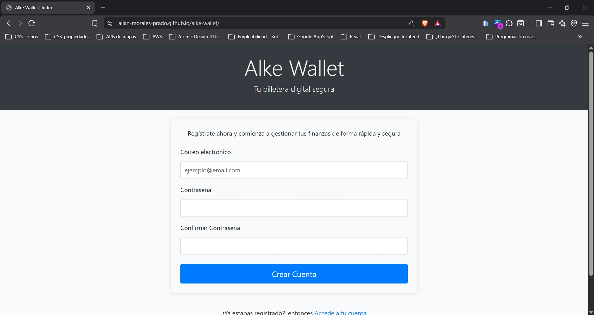
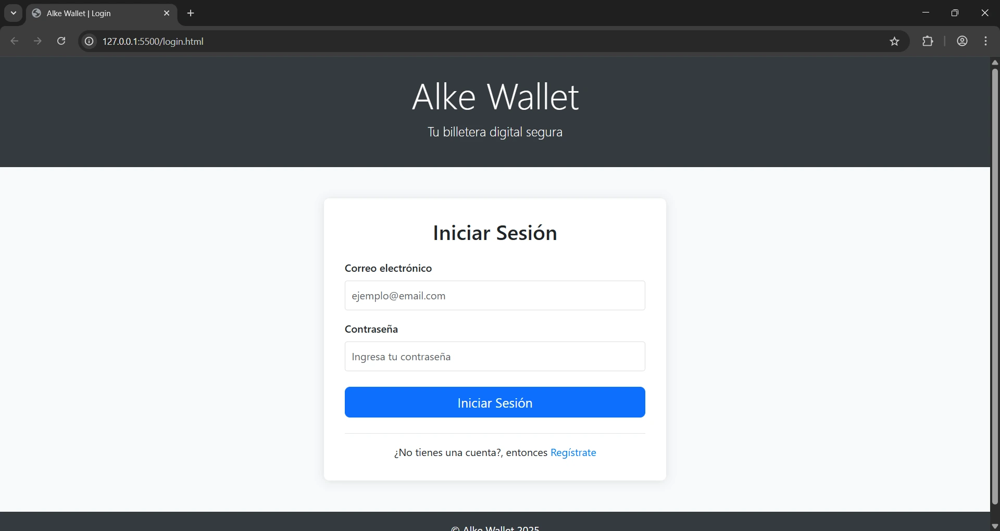
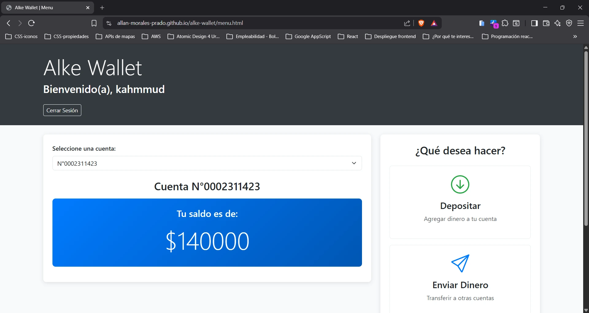
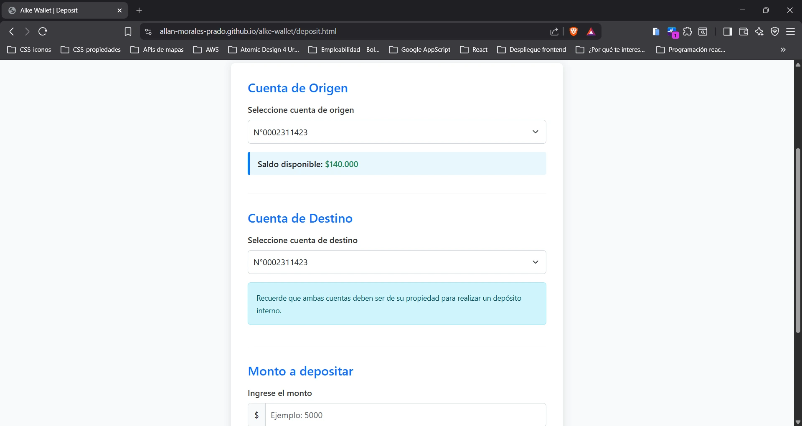
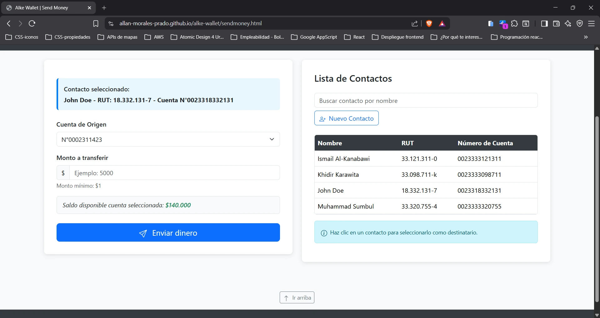
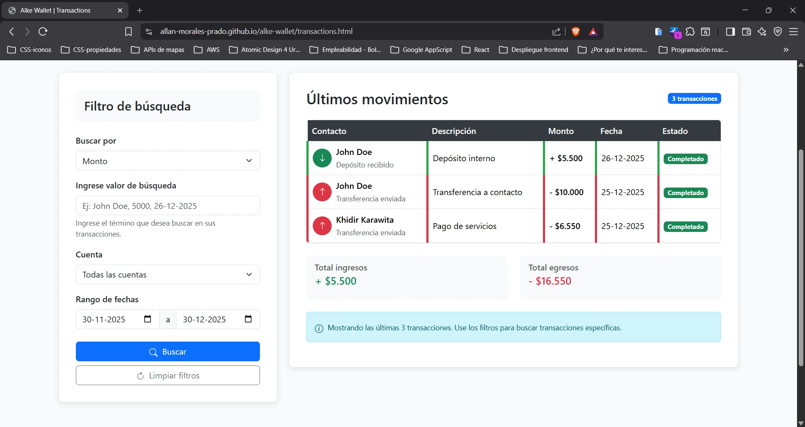
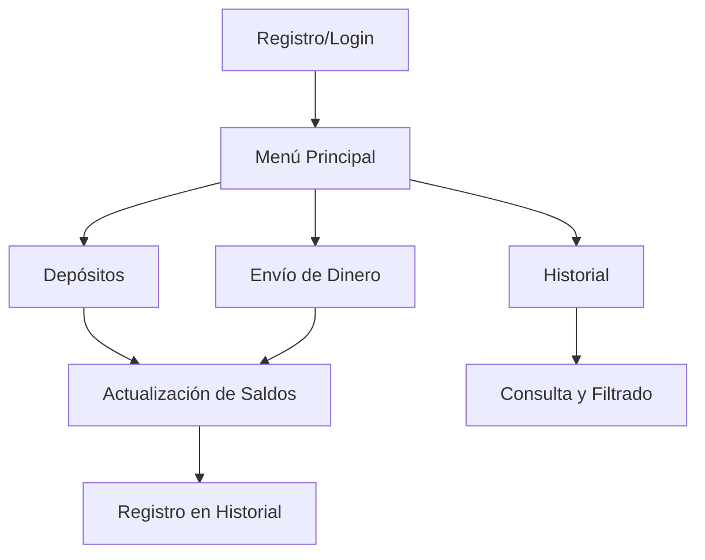

# Alke Wallet - Billetera Digital

## Descripción del Producto

Alke Wallet es una aplicación web de billetera digital que permite a los usuarios gestionar sus finanzas personales de manera segura y sencilla. La aplicación ofrece funcionalidades completas para transferencias, depósitos y seguimiento de transacciones, todo en una interfaz intuitiva y responsiva.

## Características Principales

### 1. **Autenticación de Usuarios**
- Registro de nuevos usuarios
- Inicio de sesión seguro con validación
- Modo invitado para pruebas
- Persistencia de sesión mediante localStorage

### 2. **Gestión de Múltiples Cuentas**
- Hasta 3 cuentas bancarias por usuario
- Visualización de saldos en tiempo real
- Selección flexible entre cuentas

### 3. **Operaciones Financieras**
- **Depósitos internos**: Transferencias entre cuentas propias
- **Envío de dinero**: Transferencias a contactos externos
- **Validación en tiempo real**: Verificación de saldos suficientes

### 4. **Gestión de Contactos**
- Lista de contactos frecuentes
- Búsqueda y filtrado de contactos
- Agregar nuevos contactos mediante formulario modal

### 5. **Historial de Transacciones**
- Registro completo de todas las operaciones
- Filtros avanzados por cuenta, fecha, monto y tipo
- Resumen de ingresos y egresos

## Estructura de Archivos

```
alke-wallet/
├── index.html          # Página de registro
├── login.html          # Página de inicio de sesión
├── menu.html           # Menú principal
├── deposit.html        # Página de depósitos
├── sendmoney.html      # Página de envío de dinero
└── transactions.html   # Historial de transacciones
```

## Páginas y Funcionalidades

### 1. **Página de Registro (index.html)**



**Funcionalidades:**
- Formulario de registro con validación
- Almacenamiento seguro de credenciales en localStorage
- Redirección automática al menú principal

**Características técnicas:**
- Validación de formato de email
- Confirmación de contraseña
- Mensajes de error/éxito con Bootstrap Alerts

### 2. **Página de Login (login.html)**



**Funcionalidades:**
- Autenticación mediante email y contraseña
- Validación contra usuarios registrados
- Enlace para registro de nuevos usuarios

**Seguridad:**
- Método POST para envío de credenciales
- Almacenamiento de sesión en localStorage
- Protección contra credenciales inválidas

### 3. **Menú Principal (menu.html)**



**Componentes:**
- Bienvenida personalizada con nombre de usuario
- Selector de cuentas con saldos actualizados
- Tarjetas de acciones principales:
  - Depósito
  - Enviar dinero
  - Historial de transacciones

**Funcionalidades:**
- Visualización de saldos en tiempo real
- Navegación intuitiva entre secciones
- Botón de cierre de sesión

### 4. **Página de Depósitos (deposit.html)**



**Funcionalidades:**
- Selección de cuenta de origen y destino
- Validación de cuentas diferentes
- Verificación de saldo disponible
- Confirmación de transacción

**Validaciones:**
- Saldo suficiente
- Monto mínimo ($1)
- Cuentas diferentes
- Formato numérico válido

### 5. **Página de Envío de Dinero (sendmoney.html)**



**Funcionalidades:**
- Lista de contactos con búsqueda
- Modal para agregar nuevos contactos
- Selección de cuenta de origen
- Validación de saldo disponible
- Confirmación de transferencia

**Gestión de contactos:**
- Almacenamiento en localStorage
- Búsqueda en tiempo real
- Selección mediante clic
- Validación de datos de contacto

### 6. **Historial de Transacciones (transactions.html)**



**Funcionalidades:**
- Tabla completa de transacciones
- Filtros avanzados:
  - Por cuenta
  - Por rango de fechas
  - Por tipo de transacción
  - Por monto o nombre
- Totales de ingresos y egresos

**Visualización:**
- Código de colores (verde para ingresos, rojo para egresos)
- Iconos diferenciados
- Estados de transacción
- Fechas formateadas

## Tecnologías Utilizadas

### Frontend
- **HTML5**: Estructura semántica
- **CSS3**: Estilos personalizados y responsivos
- **Bootstrap 5.3.8**: Framework para diseño responsivo
- **JavaScript**: Lógica de aplicación
- **SVG Icons**: Iconografía consistente

### Almacenamiento
- **localStorage**: Persistencia de datos del cliente
  - Usuarios registrados
  - Sesiones activas
  - Contactos
  - Transacciones
  - Balances de cuentas

## Flujo de Usuario



## Responsive Design

La aplicación está diseñada para funcionar en todos los dispositivos:

### Mobile (≤576px)
- Menús de navegación colapsables
- Contenedores adaptados
- Tablas con scroll horizontal
- Botones de tamaño optimizado

### Tablet (≤768px)
- Layout de dos columnas
- Padding reducido
- Fuentes ajustadas
- Formularios optimizados

### Desktop (≥992px)
- Layout completo
- Espaciado óptimo
- Visualización completa de tablas
- Efectos hover y transiciones

## Persistencia de Datos

### Estructura de Datos en localStorage

```javascript
// Usuarios registrados
alke_wallet_users = [
  {
    email: "usuario@ejemplo.com",
    password: "hash_password",
    name: "Nombre Usuario"
  }
]

// Sesión activa
alke_current_user = "usuario@ejemplo.com"

// Contactos
alke_wallet_contacts = [
  {
    name: "Contacto Ejemplo",
    rut: "12.345.678-9",
    account: "0023312345678"
  }
]

// Transacciones
alke_wallet_transactions = [
  {
    type: "deposit/transfer",
    from: "N°0002311423",
    to: "Nombre Contacto",
    amount: 5000,
    date: "2025-01-15T10:30:00",
    newBalance: 145000
  }
]

// Balances
alke_wallet_balances = {
  "N°0002311423": 140000,
  "N°0002355196": 75500,
  "N°0002378830": 210750
}
```

## Validaciones y Seguridad

### Validaciones del Lado del Cliente
1. **Formularios**: Campos requeridos, formatos específicos
2. **Saldo**: Verificación de fondos suficientes
3. **Cuentas**: Prevención de transferencias a la misma cuenta
4. **Montos**: Valores positivos y mínimos

### Manejo de Sesiones
- Sesión persistente durante la navegación
- Cierre de sesión con limpieza de datos
- Protección contra acceso no autorizado

## Instalación y Uso

### Requisitos
- Navegador web moderno (Chrome, Firefox, Safari, Edge)
- JavaScript habilitado
- Conexión a internet (para CDN de Bootstrap)

### Pasos de Instalación
1. Descargar todos los archivos HTML en una carpeta
2. Asegurar que todos los archivos estén en el mismo directorio
3. Abrir `index.html` en el navegador
4. Registrar un nuevo usuario o usar credenciales de prueba

### Datos de Prueba
La aplicación incluye datos iniciales:
- 3 cuentas bancarias con saldos diferentes
- 4 contactos predefinidos
- Funcionalidad completa sin necesidad de backend

## Futuras Mejoras

### Próximas Características
1. **Categorización de gastos**
2. **Gráficos de análisis financiero**
3. **Exportación de transacciones (PDF/CSV)**
4. **Notificaciones push**
5. **Recuperación de contraseña**

### Mejoras Técnicas
1. **Encriptación de datos sensibles**
2. **Implementación de Service Workers para PWA**
3. **Integración con APIs de bancos reales**
4. **Sistema de respaldo en la nube**

## Conclusión

Alke Wallet demuestra un sistema completo de billetera digital utilizando solo tecnologías frontend. La aplicación es completamente funcional, responsiva y segura, proporcionando una experiencia de usuario similar a aplicaciones bancarias reales.

**Puntos destacados:**
- ✅ Interfaz intuitiva y profesional
- ✅ Validaciones completas del lado del cliente
- ✅ Persistencia de datos entre sesiones
- ✅ Diseño completamente responsivo
- ✅ Sistema de gestión de contactos integrado
- ✅ Historial detallado con filtros avanzados

---

**Nota:** Para usar la aplicación, simplemente abra `index.html` en su navegador web. No se requiere instalación de servidores ni configuración adicional.
